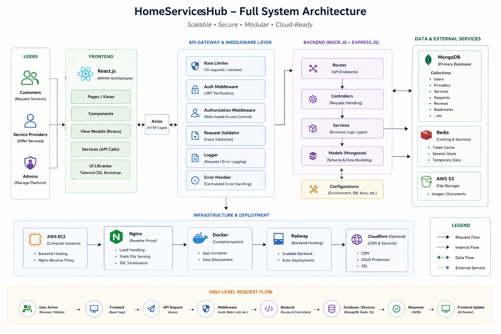
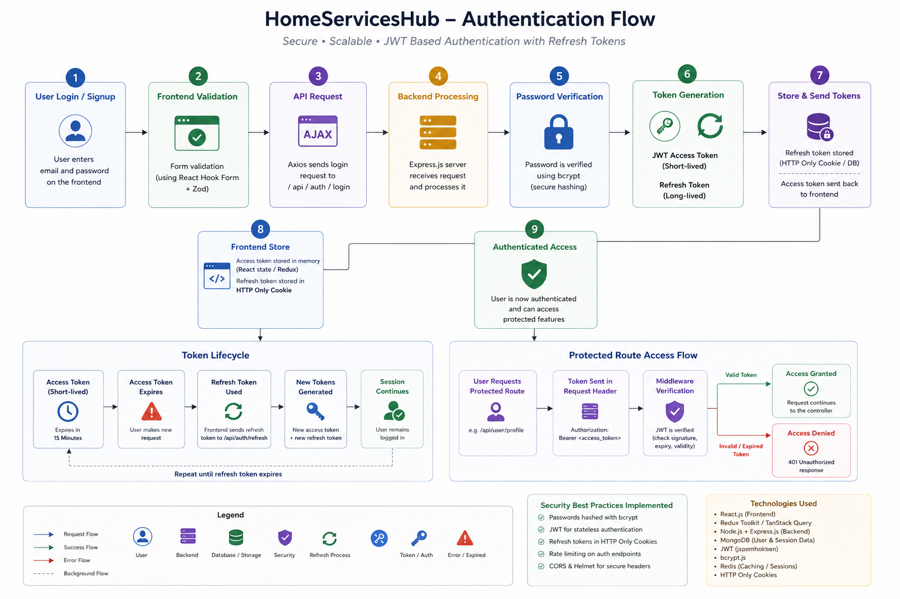

<div align="center">


# HomeServicesHub

**Scalable cloud-based marketplace connecting users with trusted local service providers**  
_through intelligent search, structured booking workflows, and role-based system architecture._

[](https://homeserviceshub.in)
[](https://react.dev)
[](https://nodejs.org)
[](https://mongodb.com)
[](https://redis.io)
[](https://aws.amazon.com/s3)

</div>

---

## 📸 Platform Preview

### 🏠 Home Page


---

### 🔍 Provider Search — Step by Step

|                               Step 1 — Browse & Filter                                |                               Step 2 — Select Provider                                |
| :-----------------------------------------------------------------------------------: | :-----------------------------------------------------------------------------------: |
|  |  |

|                              Step 3 — View Full Profile                               |
| :-----------------------------------------------------------------------------------: |
|  |

---

### 📋 Multi-Step Booking Workflow

|                           Step 1 — Choose Service                            |                            Step 2 — Describe Job                             |
| :--------------------------------------------------------------------------: | :--------------------------------------------------------------------------: |
|  |  |

|                         Step 3 — Set Location & Time                         |                           Step 4 — Confirm Details                           |
| :--------------------------------------------------------------------------: | :--------------------------------------------------------------------------: |
|  |  |

|                           Step 5 — Submit Request                            |
| :--------------------------------------------------------------------------: |
|  |

---

## 🗺️ System Architecture



---

## 🔐 Authentication Architecture



---

## 🧭 Overview

**HomeServicesHub** is a production-grade, full-stack marketplace platform built to solve the fragmented and inefficient process of discovering and booking local home service professionals.

The platform supports **three distinct user roles** — Customers, Service Providers, and Administrators — each with its own authentication path, dashboard, and feature set. It is built with an emphasis on **scalable cloud architecture**, **secure token-based auth**, **modular backend design**, and a **clean MVVM frontend pattern**.

> This project reflects deep interest in scalable cloud-based systems, backend engineering, intelligent web platforms, and applied software architecture.

---

## ✨ Key Features

### For Customers

- 🔍 **Intelligent Provider Discovery** — category, location, rating, and availability filters
- 📋 **5-Step Guided Booking Workflow** — structured service request with job description, location, timing, and custom notes
- ⭐ **Review & Rating System** — submit and browse verified reviews per provider
- 🔖 **Bookmark Providers** — save preferred providers for quick access
- 👤 **User Profile Management** — personal dashboard and account settings

### For Service Providers

- 🏢 **Rich Provider Profiles** — company intro, gallery, awards, availability schedule, service areas, payment methods
- 📊 **Analytics Dashboard** — request volume, response rate, project history, rating breakdown
- 📥 **Incoming Request Management** — accept/reject service requests with tracked response times
- 🔏 **Verification System** — submit Aadhaar, PAN, GST documents for admin verification badge
- 🔄 **Change Requests** — update profile details (10 free changes included)

### For Administrators

- 🛡️ **Admin Dashboard** — platform-wide stats (users, providers, requests, services)
- ✅ **Provider Verification Panel** — review ID proofs and approve/reject providers
- 📦 **Full CRUD Management** — users, providers, services, trending services, service requests
- 📧 **Automated Notification Emails** — new registrations, verification status changes

### Platform-Wide

- 🔐 **JWT Auth with Dual-Token Lifecycle** — 15-min access token + 90-day refresh token stored in Redis
- 🚦 **Multi-layer Rate Limiting** — per-IP global throttle (200 req / 10 min) + per-user route-level limits
- 🌐 **SEO Optimized** — `react-helmet-async`, sitemap, `robots.txt`, semantic HTML
- 🍪 **Cookie Consent Management** — GDPR-compliant consent banner
- 📱 **Fully Responsive** — mobile-first Tailwind CSS v4 layout

---

## 🏗️ Tech Stack

### Frontend

| Technology                    | Role                                          |
| ----------------------------- | --------------------------------------------- |
| **React 18** + **Vite 6**     | UI framework and build tooling                |
| **Tailwind CSS v4**           | Utility-first styling system                  |
| **React Router DOM v7**       | Client-side routing (28 pages)                |
| **Redux Toolkit**             | Client-side global state management           |
| **TanStack Query v5**         | Server state, caching, and background refetch |
| **React Hook Form** + **Zod** | Form management and schema validation         |
| **Framer Motion**             | Animations and micro-interactions             |
| **Axios**                     | HTTP client with credentials support          |
| **react-helmet-async**        | SEO meta tag management                       |

### Backend

| Technology                      | Role                                     |
| ------------------------------- | ---------------------------------------- |
| **Node.js** + **Express.js v5** | REST API server                          |
| **Mongoose v8**                 | MongoDB ODM                              |
| **jsonwebtoken**                | JWT access & refresh token signing       |
| **bcryptjs**                    | Password hashing (cost factor 12)        |
| **ioredis**                     | Redis client for token store & OTP cache |
| **multer** + **multer-s3**      | File upload pipeline to AWS S3           |
| **nodemailer** + **resend**     | Dual email provider (OTP, notifications) |
| **helmet**                      | HTTP security headers                    |
| **express-rate-limit**          | IP and user-level rate limiting          |
| **morgan**                      | HTTP request logging                     |

### Infrastructure

| Service           | Role                                                  |
| ----------------- | ----------------------------------------------------- |
| **MongoDB Atlas** | Primary database                                      |
| **Redis**         | Refresh token storage, OTP cache, rate limit counters |
| **AWS S3**        | Provider image and gallery storage                    |
| **Vercel**        | Frontend deployment with edge CDN                     |
| **Railway**       | Backend deployment                                    |

---

## 🧱 Architecture Deep-Dive

### Frontend — MVVM Pattern

```
src/
├── pages/          ← 28 route-level page components
├── view/           ← UI section components (organized by domain)
│   ├── homeView/
│   ├── authView/
│   ├── adminView/
│   ├── providerProfileView/
│   ├── servicesView/
│   ├── serviceProvidersView/
│   └── userView/
├── viewModel/      ← Business logic hooks (18 view models)
├── model/          ← API call layer (Axios wrappers)
├── redux/          ← Redux Toolkit store + slices
├── router/         ← React Router configuration
├── components/     ← Shared/layout/common components
├── hooks/          ← Custom React hooks
├── utils/          ← Helpers (axiosClient, handleAsync, session recovery)
└── seo/            ← SEO configuration
```

### Backend — Layered Service Architecture

```
server/
├── server.js           ← Entry point, middleware registration, route mounting
├── routes/             ← 8 route modules (/auth, /users, /providers, /admin, /services, /bookmarks, /reviews, /health)
├── controllers/        ← Request handlers (7 controllers)
├── services/           ← Business logic (email, OTP, token, cookie, location)
├── middleware/         ← Auth, role guard, rate limiter, error handler
├── models/             ← 7 Mongoose schemas
├── config/             ← DB, Redis, S3, CORS, JWT, environment
└── utils/              ← Async handler, token utilities
```

### Database — User Document Schema

The entire user system is stored in a **single polymorphic `User` collection** with conditional sub-documents:

```
User {
  accountType: "user" | "provider" | "both" | "admin"
  userProfile:     { fullName, email, passwordHash, phone, location, profilePhoto, bookmarks[] }
  providerProfile: { companyName, providerPass, phone, location, services[], serviceAreas[],
                     availability[], paymentMethods[], gallery[], verification: { status, idProof },
                     overallRating, avgReviewRating, avgResponseTime, projectsDone, ... }
  resetToken, resetTokenExpiry
}
```

> A user who is both a customer and provider gets `accountType: "both"` — no duplicate records.

---

## 🔐 Authentication Flow Summary

```
Registration (User):  [Fill Form] → [Send OTP] → [Verify OTP] → [Register] → [JWT Cookies Set]
Registration (Provider): [Fill Form] → [Optional OTP] → [Register] → [JWT Cookies Set]
Login (User):         [email + password] → [bcrypt.compare] → [JWT Cookies Set]
Login (Provider):     [phone + password] → [bcrypt.compare] → [JWT Cookies Set]
Session Recovery:     [GET /auth/status] → 401 → [POST /auth/refresh] → [New Access Token]
Logout:               [POST /auth/logout] → [Redis DEL] → [clearCookie x2]
```

| Token               | Expiry                                    | Storage                   |
| ------------------- | ----------------------------------------- | ------------------------- |
| Access Token (JWT)  | **15 minutes**                            | `httpOnly` cookie         |
| Refresh Token (JWT) | **7 days** (cookie) / **90 days** (Redis) | `httpOnly` cookie + Redis |
| Registration OTP    | **10 minutes**                            | Redis `reg-otp:{email}`   |
| Session OTP         | **5 minutes**                             | Redis `otp:{userId}`      |

---

## 🚦 API Endpoints

| Method | Route                               | Auth     | Description               |
| ------ | ----------------------------------- | -------- | ------------------------- |
| `POST` | `/api/auth/register/user`           | Public   | Register new user         |
| `POST` | `/api/auth/register/provider`       | Public   | Register new provider     |
| `POST` | `/api/auth/login/user`              | Public   | User login                |
| `POST` | `/api/auth/login/provider`          | Public   | Provider login            |
| `POST` | `/api/auth/logout`                  | 🔒 Auth  | Logout + clear tokens     |
| `POST` | `/api/auth/refresh`                 | Public   | Refresh access token      |
| `GET`  | `/api/auth/status`                  | 🔒 Auth  | Check session status      |
| `POST` | `/api/auth/send-registration-otp`   | Public   | Send email OTP for signup |
| `POST` | `/api/auth/verify-registration-otp` | Public   | Verify signup OTP         |
| `POST` | `/api/auth/forgot-password`         | Public   | Initiate password reset   |
| `POST` | `/api/auth/reset-password`          | Public   | Complete password reset   |
| `GET`  | `/api/providers`                    | Public   | List + filter providers   |
| `GET`  | `/api/providers/:id`                | Public   | Provider public profile   |
| `GET`  | `/api/services`                     | Public   | All service categories    |
| `POST` | `/api/bookmarks`                    | 🔒 User  | Bookmark a provider       |
| `POST` | `/api/reviews`                      | 🔒 User  | Submit a review           |
| `GET`  | `/api/admin/stats`                  | 🔒 Admin | Platform statistics       |
| `GET`  | `/health`                           | Public   | Server health check       |

---

## 📁 Project Structure

```
homeserviceshub/
├── client/                         ← React + Vite frontend
│   ├── public/
│   │   └── assets/
│   │       ├── screenshots/        ← Platform screenshots
│   │       ├── images/             ← Hero, logo, service imagery
│   │       └── icons/              ← SVG icons
│   └── src/
│       ├── pages/                  ← 28 route pages
│       ├── view/                   ← MVVM view layer
│       ├── viewModel/              ← MVVM viewmodel layer (18 files)
│       ├── model/                  ← MVVM model layer (API calls)
│       ├── components/             ← Reusable UI components
│       ├── redux/                  ← State management
│       ├── router/                 ← App routing
│       └── utils/                  ← Shared utilities
│
└── server/                         ← Node.js + Express backend
    ├── controllers/                ← 7 request handler modules
    ├── routes/                     ← 8 API route modules
    ├── services/                   ← Email, OTP, token, cookie logic
    ├── middleware/                 ← Auth, roles, rate limiting, errors
    ├── models/                     ← 7 Mongoose schemas
    ├── config/                     ← DB, Redis, S3, CORS, JWT
    └── utils/                      ← asyncHandler, token utilities
```

---

## 🚀 Getting Started

### Prerequisites

- Node.js ≥ 18
- MongoDB Atlas connection string
- Redis instance (local or cloud)
- AWS S3 bucket + IAM credentials
- Resend API key (or SMTP config for Nodemailer)

### Clone & Install

```bash
git clone https://github.com/harman-sidhu0001/homeserviceshub.git
cd homeserviceshub

# Install client dependencies
cd client && npm install

# Install server dependencies
cd ../server && npm install
```

### Environment Configuration

**`server/.env`**

```env
NODE_ENV=development
PORT=5000
MONGO_URI=your_mongodb_atlas_uri
ACCESS_TOKEN_SECRET=your_access_secret
REFRESH_TOKEN_SECRET=your_refresh_secret
REDIS_URL=your_redis_url
AWS_ACCESS_KEY_ID=your_key
AWS_SECRET_ACCESS_KEY=your_secret
AWS_REGION=ap-south-1
AWS_S3_BUCKET=your_bucket
RESEND_API_KEY=your_resend_key
ADMIN_EMAIL=admin@yourdomain.com
```

**`client/.env`**

```env
VITE_API_URL=http://localhost:5000/api
```

### Run Locally

```bash
# Terminal 1 — Start backend
cd server && npm run dev

# Terminal 2 — Start frontend
cd client && npm run dev
```

Frontend → `http://localhost:5173`  
Backend → `http://localhost:5000`

---

## 🔮 Roadmap & Future Improvements

- [ ] 🤖 **AI-powered provider recommendation** — personalized ranking based on user history
- [ ] 📡 **Real-time notifications** — WebSocket-based booking status updates
- [ ] 📊 **Advanced analytics dashboard** — revenue, demand heatmaps, conversion funnels
- [ ] 🏙️ **Multi-city expansion** — location-aware provider pools
- [ ] ☁️ **Auto-scaling infrastructure** — Kubernetes + horizontal pod autoscaling
- [ ] 💳 **Payment integration** — Razorpay / Stripe in-app transactions
- [ ] 🔍 **Intelligent search** — full-text + semantic provider search
- [ ] 📱 **Native mobile app** — React Native client

---

## 🤝 Connect

<div align="center">

**Harmanjot Singh Sidhu**

[](https://www.linkedin.com/in/harmanjotsinghsidhu0202)
[](https://github.com/harman-sidhu0001)
[](https://www.instagram.com/homeserviceshub.in)
[](https://www.facebook.com/people/Home-Services-Hub/61578393999115)
[](https://www.youtube.com/channel/UCIYcXxFXiRYekGovgC_ACVw)

</div>

---

<div align="center">

© 2025 HomeServicesHub.in — All rights reserved.

_Built with ❤️ to simplify home services for everyone._

</div>
