    

    <b>Automatic Architecture Diagrams from Code</b> 
    <a href="https://github.com/swark-io/swark">GitHub</a> • <a href="https://swark.io">Website</a> • <a href="mailto:contact@swark.io">Contact Us</a>

## Usage Instructions

1. **Render the Diagram**: Use the links below to open it in Mermaid Live Editor, or install the [Mermaid Support](https://marketplace.visualstudio.com/items?itemName=bierner.markdown-mermaid) extension.
2. **Recommended Model**: If available for you, use `claude-3.5-sonnet` [language model](vscode://settings/swark.languageModel). It can process more files and generates better diagrams.
3. **Iterate for Best Results**: Language models are non-deterministic. Generate the diagram multiple times and choose the best result.

## Generated Content
**Model**: GPT-4o - [Change Model](vscode://settings/swark.languageModel)  
**Mermaid Live Editor**: [View](https://mermaid.live/view#pako:eNqNlj2T2yAQhv-Kh_ouTToXKeIrUiSNz1ehFFisLc4IFED2ZG7uvwcbYS0fytiN9919FsHCIn2QVnMga9Koo2FDt9q9NGrlf3bcB8crmDOY4EwCG60O4jgHrj--D17K91_e7e80CD0TcoojuwRbbezEzWZlPHUWRqselIujzp4St18nKholYoCL-ORgS1Ed6_0SH-mtNAyKN6pSrl-CcwkXZiAdio2um2M0lZVFG6PND6Y8YCgWldUwBz9FL5wnkV0BtQQ0hVQ-uDp_iqRNh32zYG5-erXKx15PlmhhC39GsC6QqW8xxya0Lbmd8TMV6jgRAc-cZdYWzgIuAQ52yXzX-tQzcwpUVCW36Zg6potLXI_VNa6w0klTiGJRTkPqljmhVaQzXSY4fYI7jUWJajfE-VFk1xpanwTEQRP1WBnenMhP15lJwZnz9wOdzYXl3NLpbJYYs39VG9sKixIdB6kZj2yiajeKHbSysBM9bJhsR3mdJ627qy3szytOzByPlW-rR5efIcZ7oUKAIrtSGn8jRe5uVsrie3zCZrPEBqPPgt_RVFYu7elMTXgqS3w_teOEp7K2O9cen2AsSrQDJu91wOKxHfBvC-fvVX9GatswR2mm69uB-UTWtwXhqVzeHpRSupa3CaWVrqX6o6TcsbzDKKl0_X9Pbh80NPzNJKJCaPX8_K14a6MQ_v7BGehNiNzpRY4C6GpDXtyxwY7PTI8RchRPz2PpFPIomse86EpeFlxOy6bia1WfRQzgUpMn0oPxLzbuP00_GuI66KEh61VDOBzYKF1DPj00Dv7ehxfBfJf1ZO3MCE_Et4R-9Td41EaPx46sD0xa-PwHKPOGzQ) | [Edit](https://mermaid.live/edit#pako:eNqNlj2T2yAQhv-Kh_ouTToXKeIrUiSNz1ehFFisLc4IFED2ZG7uvwcbYS0fytiN9919FsHCIn2QVnMga9Koo2FDt9q9NGrlf3bcB8crmDOY4EwCG60O4jgHrj--D17K91_e7e80CD0TcoojuwRbbezEzWZlPHUWRqselIujzp4St18nKholYoCL-ORgS1Ed6_0SH-mtNAyKN6pSrl-CcwkXZiAdio2um2M0lZVFG6PND6Y8YCgWldUwBz9FL5wnkV0BtQQ0hVQ-uDp_iqRNh32zYG5-erXKx15PlmhhC39GsC6QqW8xxya0Lbmd8TMV6jgRAc-cZdYWzgIuAQ52yXzX-tQzcwpUVCW36Zg6potLXI_VNa6w0klTiGJRTkPqljmhVaQzXSY4fYI7jUWJajfE-VFk1xpanwTEQRP1WBnenMhP15lJwZnz9wOdzYXl3NLpbJYYs39VG9sKixIdB6kZj2yiajeKHbSysBM9bJhsR3mdJ627qy3szytOzByPlW-rR5efIcZ7oUKAIrtSGn8jRe5uVsrie3zCZrPEBqPPgt_RVFYu7elMTXgqS3w_teOEp7K2O9cen2AsSrQDJu91wOKxHfBvC-fvVX9GatswR2mm69uB-UTWtwXhqVzeHpRSupa3CaWVrqX6o6TcsbzDKKl0_X9Pbh80NPzNJKJCaPX8_K14a6MQ_v7BGehNiNzpRY4C6GpDXtyxwY7PTI8RchRPz2PpFPIomse86EpeFlxOy6bia1WfRQzgUpMn0oPxLzbuP00_GuI66KEh61VDOBzYKF1DPj00Dv7ehxfBfJf1ZO3MCE_Et4R-9Td41EaPx46sD0xa-PwHKPOGzQ)

```mermaid
graph TD
    subgraph Server
        subgraph Config
            dbConfig[db.js]
            emailConfig[emailConfig.js]
            corsConfig[corsConfig.js]
            environmentConfig[environment.js]
            s3Config[s3Config.js]
            redisConfig[redisClient.js]
            jwtConfig[jwt.js]
        end

        subgraph Middleware
            authMiddleware[authMiddleware.js]
            errorHandler[errorHandler.js]
            rateLimiter[rateLimiter.js]
            roleMiddleware[roleMiddleware.js]
        end

        subgraph Models
            UserModel[User.js]
            ServiceRequestModel[ServiceRequest.js]
            ServicesModel[Services.js]
            TrendingServiceModel[TrendingService.js]
            ReviewModel[Review.js]
            BookmarkModel[Bookmark.js]
            ChangeRequestModel[ChangeRequest.js]
        end

        subgraph Services
            emailService[emailService.js]
            locationService[locationService.js]
            tokenService[tokenService.js]
            otpServices[otpServices.js]
            cookieService[cookieService.js]
        end

        subgraph Utils
            validators[validators.js]
            tokenUtils[tokenUtils.js]
            asyncHandler[asyncHandler.js]
            uploadHandler[uploadHandler.js]
            responseTimeCalculator[responseTimeCalculator.js]
            ratingCalculator[ratingCalculator.js]
        end

        subgraph Routes
            adminRoutes[adminRoutes.js]
            authRoutes[authRoutes.js]
            userRoutes[userRoutes.js]
            providerRoutes[providerRoutes.js]
            servicesRoutes[servicesRoutes.js]
            bookmarkRoutes[bookmarkRoutes.js]
            reviewRoutes[reviewRoutes.js]
            healthRoutes[healthRoutes.js]
        end

        subgraph Controllers
            adminController[adminController.js]
            authController[authController.js]
            userController[userController.js]
            providerController[providerController.js]
            servicesController[servicesController.js]
            reviewController[reviewController.js]
            bookmarkController[bookmarkController.js]
        end

        server[server.js]
    end

    server --> Middleware
    server --> Config
    server --> Models
    server --> Services
    server --> Utils
    server --> Routes
    Routes --> Controllers
    Controllers --> Models
    Controllers --> Services
    Controllers --> Utils
    Middleware --> Services
    Middleware --> Utils
    Middleware --> Models
    Config --> Services
    Config --> Middleware
```

