    

    <b>Automatic Architecture Diagrams from Code</b> 
    <a href="https://github.com/swark-io/swark">GitHub</a> • <a href="https://swark.io">Website</a> • <a href="mailto:contact@swark.io">Contact Us</a>

## Usage Instructions

1. **Render the Diagram**: Use the links below to open it in Mermaid Live Editor, or install the [Mermaid Support](https://marketplace.visualstudio.com/items?itemName=bierner.markdown-mermaid) extension.
2. **Recommended Model**: If available for you, use `claude-3.5-sonnet` [language model](vscode://settings/swark.languageModel). It can process more files and generates better diagrams.
3. **Iterate for Best Results**: Language models are non-deterministic. Generate the diagram multiple times and choose the best result.

## Generated Content
**Model**: GPT-4o - [Change Model](vscode://settings/swark.languageModel)  
**Mermaid Live Editor**: [View](https://mermaid.live/view#pako:eNqNl81S2zAQx1_F4zO8QA6dgaQd6NBpJgn04HAQsWI02FYqydAOw7tX1vfHKjQnafe3trwrrf55rw-0xfWi3o8dQ6fnarfaj5X88elJG7aYvWKmjZFjSccj6bxj_q2utbVZIYGeEMeGmhgShI6PMb3BLeEmQI3P0t9_7QwrR2fJrwMivWHVuEjjsQW-7Adp2x6_IYbj515N4tn7mnmKR0EO6qlBVPqZSOA7MhCBWTOPKzNJV80YZTdolA9hjZpUZvb5gmUNex4_7p5jpuzNPNJI8sa5tOSAN_j3hLnQsLFVxgjGbfArwW-a12MQu6b0ZUDsRYN2BqLLZzR28UK06ew6zFp5tHKeoXDO5JYQjPYyvTyvsnemVfaexzzfQZhKehFeM_pK2ijAmspBV-1AxnBl87yM23wEES5FxSBdziDE1LcYYMsahLhKg0FwNTZ0EhgohLanRdBWoAAGV8kHIZtlA7qkg7BKsF2BSjaI2awa0iUZhHU-DWqSC4I2iwZ1SQXhG4x6lyw9yUE483a58QN39AWPxtWoiQWTN__crS0mhwVINWGL6Y4Mg3dUV9iydg7g8NfcC5I2wgfUkxYJynjjh2ml-d_xYHuvmgC9V22yU09Ra0k9K6Cy1ZOxW6L-MPXzOxttqLwl2xr8REeOd2TAYZgxV7Mdjna5UIPkAl_2RB4dIFcPtokD58750qPnHMDp80HqAJZQe-g87o5hKUSdvmBN6jCWYLujPe-OZClkx2TmZHHyUOupzj4D3owzydMN3pHxG2VDo0bVPMy2QUe4lAeKshMIdL0sDPAd7UzkXB4JHkmP16jDulzGUM2WQkYV7BJRBu0iogC33iyy0JjkHgcE2LafG0OyK5WxkB4d4PICoWo_zUng5ulqfylDmXefE8b4byzGbQUSUYwylPkHzMjRfGgYFtqz6P_ujld_COW6RTRqbPpFupL1rWuP69tCx9NW1T4bPdaN9ZNOZf80VJeXX6K_G8H_g8zn_g1knkD9Z75YwSt3qDwCpZ75QnmeOZ3YVp5MWgJCGwYDZQ0DkaaGkVxLn10UP4PEUlgxXpT5L08QL8Q0kotdhcVSzLwwlrj6jV6FxQtPuFiGhflMwFCCxVlNwFiCaTQURnDSvCKC_aEYgolEBcGQ1zI66f5oh2Im9UX6JXWmiiXzgwIle30oH5QzuAcjmZA6M2GQArEMSL3Z5Z0CxVs-e4-9Z5wj1EnRxQISyX1SZuI7pMz5O6PMZPcEjPp-nxXO9fjUEzT20FVf1ANmcju39aJ-39fySh7wvl5U-7rFRzT1Yl9_SGg6yY2KVwTJW2ioF4JN-KJGk6Bb-UA7Z3TqnuvFEfUcf_wDANv9FQ) | [Edit](https://mermaid.live/edit#pako:eNqNl81S2zAQx1_F4zO8QA6dgaQd6NBpJgn04HAQsWI02FYqydAOw7tX1vfHKjQnafe3trwrrf55rw-0xfWi3o8dQ6fnarfaj5X88elJG7aYvWKmjZFjSccj6bxj_q2utbVZIYGeEMeGmhgShI6PMb3BLeEmQI3P0t9_7QwrR2fJrwMivWHVuEjjsQW-7Adp2x6_IYbj515N4tn7mnmKR0EO6qlBVPqZSOA7MhCBWTOPKzNJV80YZTdolA9hjZpUZvb5gmUNex4_7p5jpuzNPNJI8sa5tOSAN_j3hLnQsLFVxgjGbfArwW-a12MQu6b0ZUDsRYN2BqLLZzR28UK06ew6zFp5tHKeoXDO5JYQjPYyvTyvsnemVfaexzzfQZhKehFeM_pK2ijAmspBV-1AxnBl87yM23wEES5FxSBdziDE1LcYYMsahLhKg0FwNTZ0EhgohLanRdBWoAAGV8kHIZtlA7qkg7BKsF2BSjaI2awa0iUZhHU-DWqSC4I2iwZ1SQXhG4x6lyw9yUE483a58QN39AWPxtWoiQWTN__crS0mhwVINWGL6Y4Mg3dUV9iydg7g8NfcC5I2wgfUkxYJynjjh2ml-d_xYHuvmgC9V22yU09Ra0k9K6Cy1ZOxW6L-MPXzOxttqLwl2xr8REeOd2TAYZgxV7Mdjna5UIPkAl_2RB4dIFcPtokD58750qPnHMDp80HqAJZQe-g87o5hKUSdvmBN6jCWYLujPe-OZClkx2TmZHHyUOupzj4D3owzydMN3pHxG2VDo0bVPMy2QUe4lAeKshMIdL0sDPAd7UzkXB4JHkmP16jDulzGUM2WQkYV7BJRBu0iogC33iyy0JjkHgcE2LafG0OyK5WxkB4d4PICoWo_zUng5ulqfylDmXefE8b4byzGbQUSUYwylPkHzMjRfGgYFtqz6P_ujld_COW6RTRqbPpFupL1rWuP69tCx9NW1T4bPdaN9ZNOZf80VJeXX6K_G8H_g8zn_g1knkD9Z75YwSt3qDwCpZ75QnmeOZ3YVp5MWgJCGwYDZQ0DkaaGkVxLn10UP4PEUlgxXpT5L08QL8Q0kotdhcVSzLwwlrj6jV6FxQtPuFiGhflMwFCCxVlNwFiCaTQURnDSvCKC_aEYgolEBcGQ1zI66f5oh2Im9UX6JXWmiiXzgwIle30oH5QzuAcjmZA6M2GQArEMSL3Z5Z0CxVs-e4-9Z5wj1EnRxQISyX1SZuI7pMz5O6PMZPcEjPp-nxXO9fjUEzT20FVf1ANmcju39aJ-39fySh7wvl5U-7rFRzT1Yl9_SGg6yY2KVwTJW2ioF4JN-KJGk6Bb-UA7Z3TqnuvFEfUcf_wDANv9FQ)

```mermaid
graph TD
    subgraph Server
        subgraph Config
            DBConfig[Database Configuration]
            RedisConfig[Redis Configuration]
            JWTConfig[JWT Configuration]
            EmailConfig[Email Configuration]
        end
        subgraph Middleware
            AuthMiddleware[Authentication Middleware]
            RateLimiter[Rate Limiter]
            ErrorHandler[Error Handler]
        end
        subgraph Models
            UserModel[User Model]
            ServiceRequestModel[Service Request Model]
            ReviewModel[Review Model]
            BookmarkModel[Bookmark Model]
            ChangeRequestModel[Change Request Model]
            ServicesModel[Services Model]
        end
        subgraph Controllers
            AuthController[Authentication Controller]
            UserController[User Controller]
            ProviderController[Provider Controller]
            AdminController[Admin Controller]
            ServicesController[Services Controller]
            ReviewController[Review Controller]
            BookmarkController[Bookmark Controller]
        end
        subgraph Routes
            AuthRoutes[Authentication Routes]
            UserRoutes[User Routes]
            ProviderRoutes[Provider Routes]
            AdminRoutes[Admin Routes]
            ServicesRoutes[Services Routes]
            ReviewRoutes[Review Routes]
            BookmarkRoutes[Bookmark Routes]
            HealthRoutes[Health Routes]
        end
        subgraph Services
            TokenService[Token Service]
            OTPService[OTP Service]
            EmailService[Email Service]
            LocationService[Location Service]
        end
        subgraph Utils
            Validators[Validators]
            AsyncHandler[Async Handler]
            UploadHandler[Upload Handler]
            RatingCalculator[Rating Calculator]
            ResponseTimeCalculator[Response Time Calculator]
        end
    end

    subgraph Client
        subgraph ViewModels
            AuthViewModel[Authentication ViewModel]
            UserViewModel[User ViewModel]
            ProviderViewModel[Provider ViewModel]
            AdminViewModel[Admin ViewModel]
            ServicesViewModel[Services ViewModel]
            TrendingServicesViewModel[Trending Services ViewModel]
        end
        subgraph Views
            LoginForm[Login Form]
            RegisterForm[Register Form]
            ProviderRegisterForm[Provider Register Form]
            UserProfilePage[User Profile Page]
            ServicesPage[Services Page]
            ServiceProvidersPage[Service Providers Page]
        end
        subgraph Store
            AuthSlice[Authentication Slice]
            ProviderSlice[Provider Slice]
            AdminUsersSlice[Admin Users Slice]
            AdminProvidersSlice[Admin Providers Slice]
            AdminStatsSlice[Admin Stats Slice]
            AdminVerificationSlice[Admin Verification Slice]
        end
        subgraph Utils
            AxiosClient[Axios Client]
            APIHandler[API Handler]
            HandleAsync[Handle Async]
        end
    end

    DBConfig --> Server
    RedisConfig --> Server
    JWTConfig --> Server
    EmailConfig --> Server
    AuthMiddleware --> Routes
    RateLimiter --> Routes
    ErrorHandler --> Routes
    UserModel --> Controllers
    ServiceRequestModel --> Controllers
    ReviewModel --> Controllers
    BookmarkModel --> Controllers
    ChangeRequestModel --> Controllers
    ServicesModel --> Controllers
    AuthController --> AuthRoutes
    UserController --> UserRoutes
    ProviderController --> ProviderRoutes
    AdminController --> AdminRoutes
    ServicesController --> ServicesRoutes
    ReviewController --> ReviewRoutes
    BookmarkController --> BookmarkRoutes
    TokenService --> Controllers
    OTPService --> Controllers
    EmailService --> Controllers
    LocationService --> Controllers
    Validators --> Utils
    AsyncHandler --> Utils
    UploadHandler --> Utils
    RatingCalculator --> Utils
    ResponseTimeCalculator --> Utils
    AuthViewModel --> Views
    UserViewModel --> Views
    ProviderViewModel --> Views
    AdminViewModel --> Views
    ServicesViewModel --> Views
    TrendingServicesViewModel --> Views
    AuthSlice --> ViewModels
    ProviderSlice --> ViewModels
    AdminUsersSlice --> ViewModels
    AdminProvidersSlice --> ViewModels
    AdminStatsSlice --> ViewModels
    AdminVerificationSlice --> ViewModels
    AxiosClient --> Utils
    APIHandler --> Utils
    HandleAsync --> Utils
```

